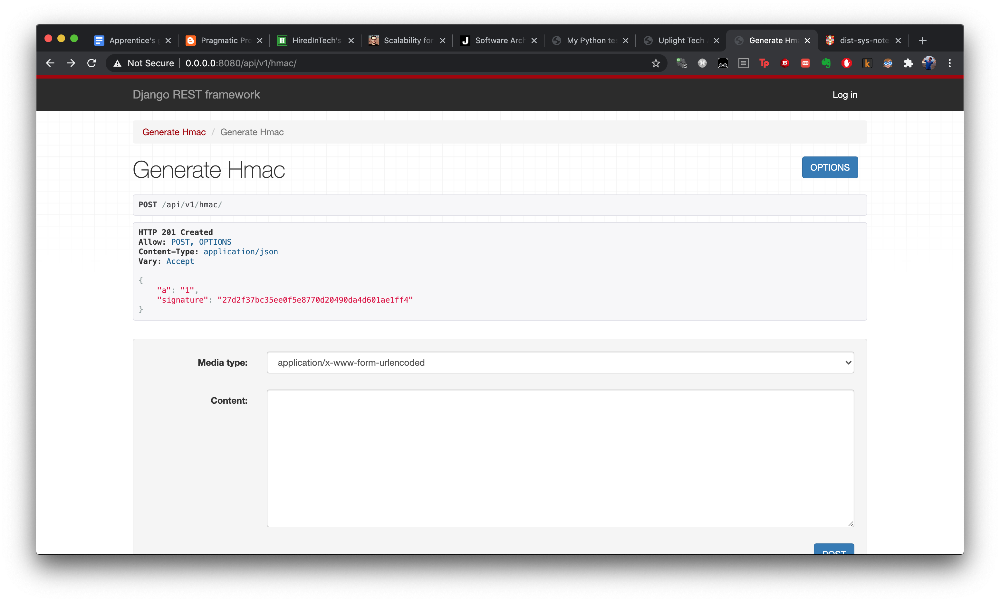

# HMAC Service

This a small demo project that creates HMAC tokens for form-urlencoded input.

When you post like so:

```
curl --data "id=MDAwMDAwMDAtMDAwMC0wMDBiLTAxMmMtMDllZGU5NDE2MDAz"  http://localhost:8080/
```

you get output like so:

```
{"id":"MDAwMDAwMDAtMDAwMC0wMDBiLTAxMmMtMDllZGU5NDE2MDAz","signature":"10a58becf76acf5ed58058f5c22f8bac21bcbbc2"}
```

## Running it

1. Clone the repo.
2. Have docker installed
3. `docker-compose up --build`
4. Hit `localhost:8080`
5. 🎉


## Usage

You may also use the `X-Hmac-Signing` header to specify either `sha1` or `sha224` as your digest algorithm.  Default is `sha1`.  Invalid choices are an error.

You can also use the DRF browsable API for convenience:




You may POST against either `api/v1/hmac/` or `/`; they are equivalent.  I prefer the former, personally.


## Questions?

Open an issue.
